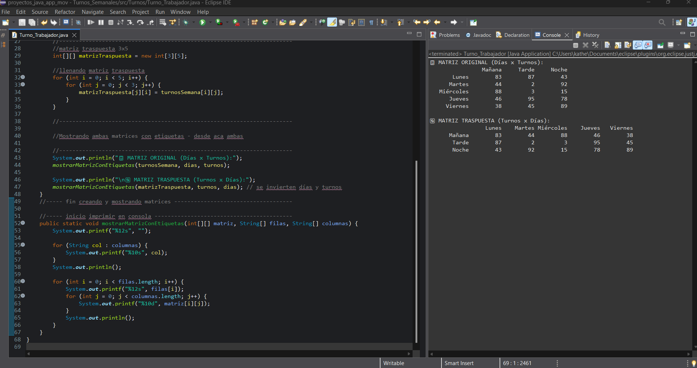

**_<h1 align="center">:vulcan_salute: Organizando Turnos Trabajadores :computer:</h1>_**

**<h3>:blue_book: Contexto:</h3>**

- En una fábrica se organizan los turnos de trabajo semanal en una matriz de 5 filas por 3 columnas, donde cada fila representa un día de la semana
(lunes a viernes) y cada columna un turno distinto (mañana, tarde y noche).
- Por motivos de reorganización, se desea generar una versión invertida de esta matriz de horarios, en la que los turnos pasen a estar
representados en filas y los días en columnas, es decir, la matriz traspuesta.
- Cada celda representa un identificador aleatorio de trabajador asignado al turno (por ejemplo, un número del 1 al 100). 
-Este ejercicio permite fortalecer el uso de matrices rectangulares, la aplicación del concepto de trasposición y la gestión de datos generados automáticamente.

**<h3>:orange_book:: Requerimientos:</h3>**

- Diseñar un algoritmo que genere aleatoriamente una matriz de 5x3 que simule asignaciones de turnos semanales, calcule su matriz traspuesta y despliegue ambas matrices: la original y la resultante.

**<h3>:green_book: Instrucciones:</h3>**

1. Declarar una matriz de 5 filas por 3 columnas para representar las asignaciones de turnos durante la semana.
2. Llenar automáticamente esta matriz con valores aleatorios entre 1 y 100 usando la función Random.
3. Declarar una segunda matriz para almacenar la traspuesta de la matriz original. No se debe sobrescribir la matriz inicial.
4. Generar la matriz traspuesta intercambiando las filas por columnas.
5. Al finalizar, mostrar en pantalla:
- La matriz original con los datos de turnos por día.
- La matriz traspuesta con los datos reorganizados por turnos.
6. Como adicional se incorporó String con el nombre del turno (mañana, tarde, noche) y día de la semana, para una mejor visualización.

**<h3>:book: Ejemplo de Salida:</h3>**

